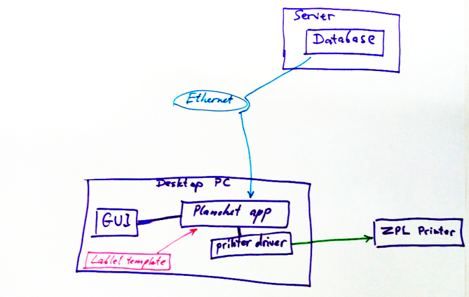
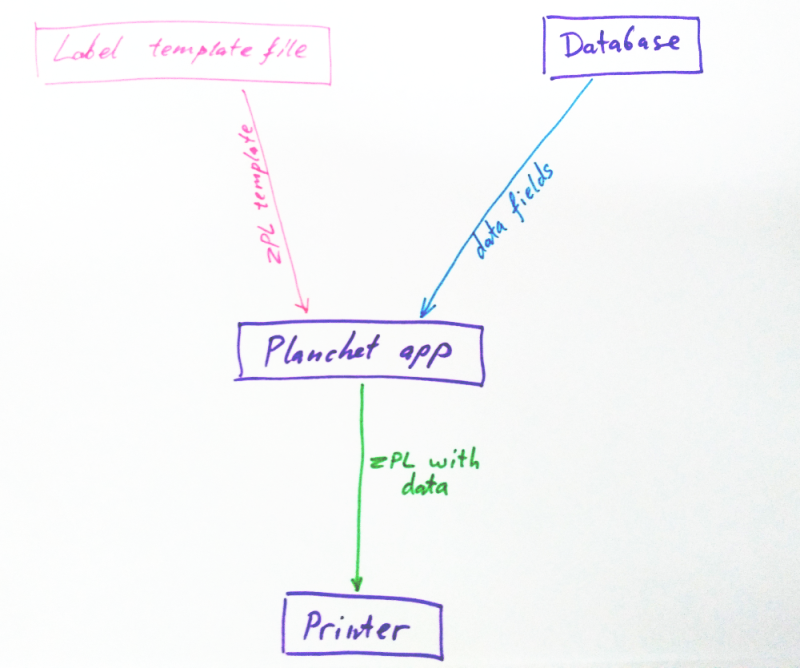
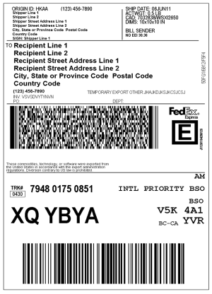
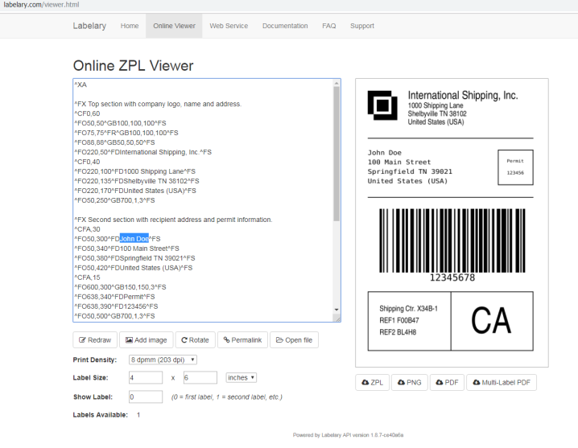
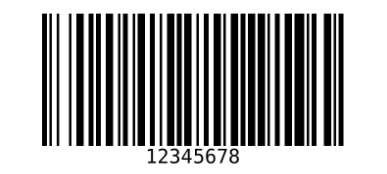
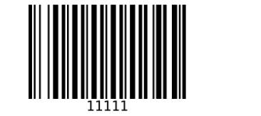
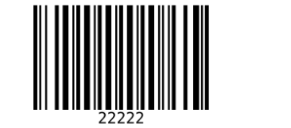
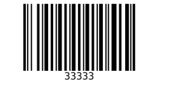
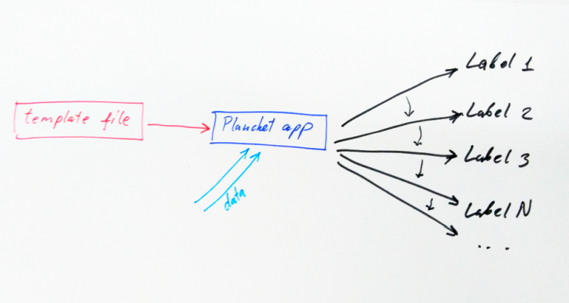
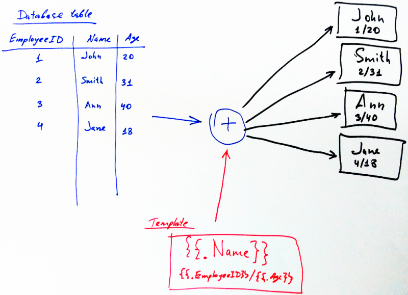

# ZPL-Label-Templates
Xenops v1.12 / ZPL Label Templates System / User's Guide

# Xenops v1.12 / ZPL Label Templates System / User's Guide

Copyright (c) 2019 Leonid Titov, All rights reserved

## Abstract

The template system allows to plug in into the system different ZPL labels, edit them,
without any modification of software which does the printing.

The architecture is:

In other words, again:

So we have:

1. Data in Database
2. Template file
3. The program which fills template with data, and sends it to printer

## What is ZPL

ZPL is Zebra Programming Language. Zebra Programming Language (ZPL and ZPL II) is a label
description language from Zebra Technologies. It is used primarily for labeling applications.
The original ZPL was advanced to ZPL II, but a full compatibility with the older version is not given.
Meanwhile, ZPL II is emulated by many label printers of various producers.

The language commands always start with a caret ('^') or tilde sign ('~'). Currently, more than
170 commands exist in ZPL II. Each format has to start with the command ^XA and end with ^XZ.
For instance, the font size is sent to the printer with the ^ADN,n,m command, where n and m are
integers denoting the font size and spacing characteristics; ^ADN,18,10 is the smallest size and
^ADN,180,100 the largest.

A simple output displaying the text "Wikipedia" can be made using code like below.

	^XA
	^LH30,30
	^FO20,10
	^ADN,90,50
	^FDWikipedia^FS
	^XZ

Comprehensive further information can be found by these links:

* [Programming Guide (PN: P1012728-008 Rev. A)](https://www.zebra.com/content/dam/zebra/manuals/printers/common/programming/zpl-zbi2-pm-en.pdf)
* [ZPL II Programming Guide (vol. I)](http://www.tracerplus.com/kb/Manuals/ZPL_Vol1.pdf)
* [ZPL II Programming Guide (vol. II)](http://www.tracerplus.com/kb/Manuals/ZPL_Vol2.pdf)
* [ZPLViewer](http://zplviewer.sourceforge.net/)
* [Online ZPL Emulator](http://labelary.com/viewer.html)

Here's an example of what ZPL is capable of:

## How to design a custom label

To make a template, you first need to design and create a label which looks just exactly like you want,
and make sure that it gets printed correctly. The label is created and edited either directly in ZPL code,
or using some kind of designer app.

The great tool to do it on-line:

* [Online ZPL Emulator](http://labelary.com/viewer.html)

You go there and design you label:

## How to make it a template

After you have finished with your design or modification, you are ready to make a template of it.

Get your ZPL code, and save it to a file, with .templ suffix. Let's say this was your design (a simple barcode):

	^XA
	^BY5,2,270
	^FO100,550^BC^FD12345678^FS
	^XZ

__Important__.
It's not a template yet. To make it a template, we must reference a variable from the program in it.
The syntax for variables is this:

	{{.VariableName}}
	
So, if for example the program which will use this template provides a variable called "ItemID", then
we can encode it in a template this way:

	^XA
	^BY5,2,270
	^FO100,550^BC^FD{{.ItemID}}^FS
	^XZ

What happened? The "12345678" was replaced with {{.ItemID}}. From now on, the program will substitute
that with actual ItemID.

For example, we have 3 items, with ItemIDs equal 11111, 22222, 33333. Now, the program can generate these
labels, from single template:

	^XA
	^BY5,2,270
	^FO100,550^BC^FD11111^FS
	^XZ

	^XA
	^BY5,2,270
	^FO100,550^BC^FD22222^FS
	^XZ

	^XA
	^BY5,2,270
	^FO100,550^BC^FD33333^FS
	^XZ

	
In other words, single template is used to generate unlimited number of similar labels, with different values
of variables:

Finally, the program which uses the template, can provide __many__ variables, which you can arbitrarily use
in your custom design. For example, the program can offer this list of variables:

* Name
* FullName
* ShortDescription
* FullDescription
* Price
* Weight
* ManufacturingDate
* ExpiredBeforeDate
* Address
* Length
* Dimensions
* CAD_part_code

And many many more. Then you can use them in any place of ZPL code, in any order. You are not required to use them all,
you can use only selected ones, and you can use them multiple times in the label design.

Exact list of variables is specific and dependent on the app that uses the template file.

Here's one more example, to illustrate the principle of template:

## How the Planchet app can aggregate database fields

Suppose, for example, that database contains __too many__ fields, or they're quite
specific, and we want to put it into some generic label. That's done by field aggregation.

The field aggregation is when we take many data fields, and concatenate them into fewer number
of fields.

Here's an example. The database table contains this row:

	 RowID   | Weight   | Length    | Color   | Name    | Price
	---------|----------|-----------|---------|---------|---------
	 000123    12kg       1000mm      beige     Joint     $10

And our template does not have all these fields. Instead, it has a Description
variable. So, the program can __aggregate__ some fields, for example put
Weight, Length, and Color, into single Description variable.

So when you'll use

	{{.Description}}
	
in your template, it will be substituted with the string:

	"Weight: 12kg, Length: 1000mm, Color: beige"

__Important to understand: this aggregation is performed by program, a user has no
power to change it.__ The program, though, can provide __both__ aggregated variables,
and original ones. So, for example, if you really need a Weight as a separate value in your design,
you can write

	{{.Weight}}

but if you want aggregated variable you use it instead.

Thus, a label designer always have great flexibility in what data to use, and any combination.

_2019-08-26_
